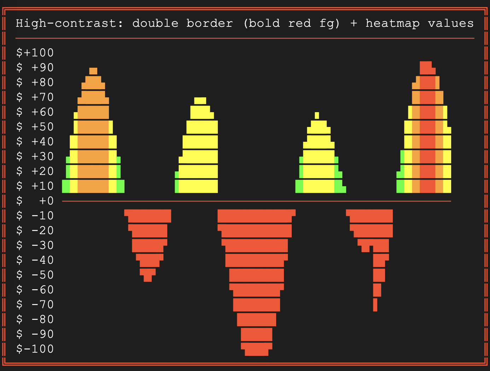

# verticalbarchart
Package to make ANSI colored box char vertical bar charts

## Usage:
```
print(VerticalBarChart(
        values,
        title="Data",
        max_value=100,
        y_label_fmt="%3.0f ",
        show_y_axis=True,
        unicode=True,
    ))
```

### Sample

